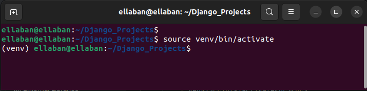

# Ecommerce Website
## python 3.11.4
## after getting this repo in your pc :
 - ## for Windows user :
    - open CMD in the (repo) folder
    - py -m venv venv <you can create venv in another folder>
    - venv\Scripts\activate  
 
    - pip install -r requirements.txt
    - py manage.py runserver
  - ## for Linux user :
    - open terminal in (repo) folder
    - python3 -m venv venv <you can create venv in another folder>
    - source venv/bin/activate

    - pip install -r requirements.txt
    - python3 manage.py runserver